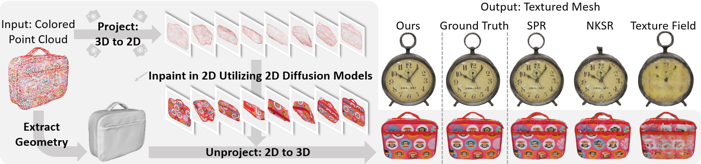
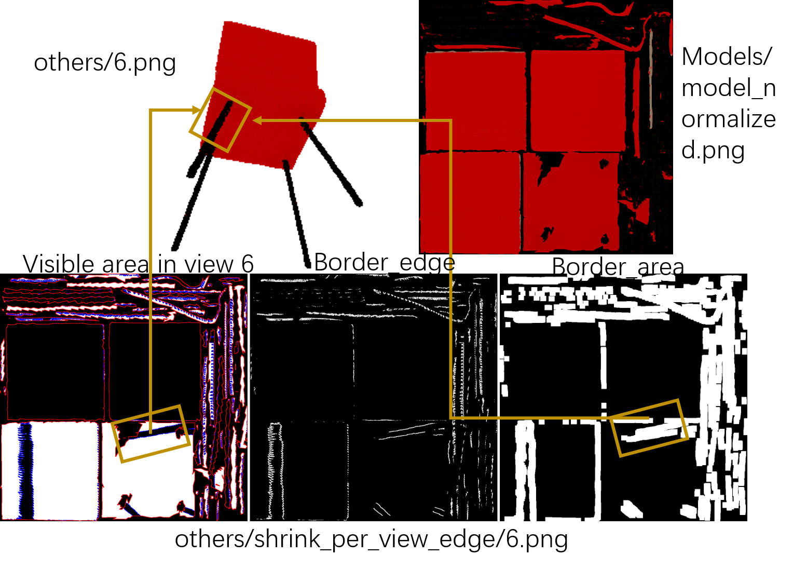

# PointDreamer: 


This repository contains the official implementation for the paper: *''PointDreamer: Zero-shot 3D Textured Mesh Reconstruction from Colored Point Cloud by 2D Inpainting''* by Qiao Yu, Xianzhi Li, Yuan Tang, Jinfeng Xu, Long Hu, Yixue Hao and Min Chen.

PointDreamer takes colored point clouds as input, and reconstructs corresponding high-quality textured meshes.




https://github.com/YuQiao0303/PointDreamer/assets/28769198/12d16fb7-ae71-4367-813e-e7e470719925

## News
- 2024.06.27: A Colab demo is now avaliable! Test by opening 'PointDreamer_demo.ipynb' in Colab.

## Install
We conduct our experiments on a single NVIDIA 3090 GPU (24G), on Ubuntu 20.04.2 operating system. It takes about 100s to reconstruct a sample on 3090. We adittionally test on an A100 GPU, which takes about 60s per-shape.

We tested on torch2.1.0, cuda11.8. Other versions may also work.
```bash
git clone https://github.com/YuQiao0303/PointDreamer.git
cd PointDreamer
conda create --name pointdreamer python=3.8
conda activate pointdreamer

pip install torch==2.1.0  torchvision==0.16.0 --index-url https://download.pytorch.org/whl/cu118
pip install kaolin==0.15.0 -f https://nvidia-kaolin.s3.us-east-2.amazonaws.com/torch-2.1.0_cu118.html
pip install git+https://github.com/NVlabs/nvdiffrast/
pip install https://data.pyg.org/whl/torch-2.1.0%2Bcu118/torch_cluster-1.6.3%2Bpt21cu118-cp38-cp38-linux_x86_64.whl
pip install requirements.txt
```

Download pre-trained weights 'ShapeNet 3k, noise, no normals' of [POCO](https://github.com/valeoai/POCO), and put it like 'models/POCO/checkpoint.pth'

```bash
wget https://github.com/valeoai/POCO/releases/download/v0.0.0/ShapeNet_3k.zip
unzip ShapeNet_3k.zip
mv ShapeNet_None_FKAConv_InterpAttentionKHeadsNet_None/checkpoint.pth models/POCO/
rm -r ShapeNet_None_FKAConv_InterpAttentionKHeadsNet_None
rm ShapeNet_3k.zip
```

The pretrained weight of [guided diffusion](https://github.com/openai/guided-diffusion) should be automatically downloaded when runnning demo.py. Alternatively, download and move it as 'models/DDNM/256x256_diffusion_uncond.pt':
```bash
wget https://openaipublic.blob.core.windows.net/diffusion/jul-2021/256x256_diffusion_uncond.pt
mv 256x256_diffusion_uncond.pt models/DDNM/
```

## Usage
To run PointDreamer, use the following command:
```bash
python demo.py --config [CONFIG_FILE] --pc_file [PC_FILE]
```
- `[CONFIG_FILE]`: path to the configuration file, e.g. 'configs/default.yaml'
- `[PC_FILE]`: path to the input point cloud file (.ply), e.g. 'dataset/demo_data/clock.ply'

By default, the results will be saved at './output'. 
The reconstructed mesh will be saved at './output/name/models/model_normalized.obj'. Make sure to open it with the '.mtl' and '.png' files in the same folder. For example, use Meshlab or Blender to open it.
If you'd like to change the output directory, change the 'output_path' in the config file.

Here are some examples:
```bash
python demo.py --config configs/default.yaml --pc_file dataset/demo_data/clock.ply
python demo.py --config configs/default.yaml --pc_file dataset/demo_data/PaulFrankLunchBox.ply
python demo.py --config configs/default.yaml --pc_file dataset/demo_data/rolling_lion.ply

python demo.py --config configs/default.yaml --pc_file dataset/NBF_demo_data/2ce6_chair.ply
python demo.py --config configs/wo_NBF.yaml --pc_file dataset/NBF_demo_data/2ce6_chair.ply
```

## Output
Here we explain the output results.
Once you've run the demo, in 'output/[objet_name]_[config_name]', e.g. 'output/clock_default/', it would look like:
- output/[objet_name]_[config_name]
  - models
    - model_normalized.mtl: corresponding material file
    - model_normalized.obj: **the textured mesh reconstructed by our PointDreamer**
    - model_normalized.png: corresponding texture file
  - geo: (the untextured mesh extracted by POCO, and corresponding UV unwrapping results )
    - ... 
  - others
    - {k}_sparse.png: The projected sparse image of view k
    - {k}_inpainted.png: The inpainted dense image of view k 
    - {k}_mask0.png: the foreground mask of the generated mesh of view k. 1 for foreground and 0 for background.
    - {k}_mask2.png: The black pixels in this mask are the pixels to be inpainted for view k.
    - shrink_per_view_edge:
      - k.png

Explanation of output/[objet_name]_[config_name]/others/shrink_per_view_edge/k.png:
The images are in UV space.
- Left: the 'k-visible-texture-atlas Tk' of view k. 
  - white pixels: the corresponding areas in atlas T which are visible from view K
  - black pixels: the corresponding areas in atlas T which are invisible from view K (occluded)
  - <font color="red">red pixels: edges of chart areas (foreground pixels)</font>
  - <font color="blue">blue pixels: edges of visible (white) and invisible（black) areas </font>
- Middle: non-border-edges of view k
  - white pixels: border-edges, i.e. left_blue - left_red (we delete chart edges, otherwise chart edges will be ignored by all views)
- Right: border-areas of view k
  - dilate border-edges in the middle image, which gives us the border-areas.

For example, in this image, the framed area is detected as border-area for this view, so it will be skipped first, and other views will have a higher priority to paint the corresponding area. So this area (bottom of chair seat) is painted as 'red', instead of wrongly 'black' in this view.


## Acknolwedgement
This work is built upon [DDNM](https://github.com/wyhuai/DDNM), [POCO](https://github.com/valeoai/POCO), and [GET3D](https://github.com/nv-tlabs/GET3D). Thank the authors for their amazing work!
